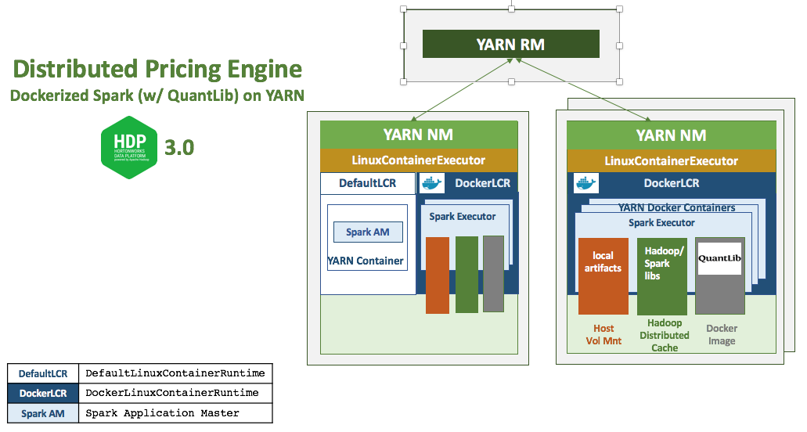

# hwx-pricing-engine
A distributed compute engine for pricing financial derivatives using QuantLib with Spark running in Docker containers on YARN with HDP 3.0.



## Setup

1. Ensure you have access to a Hortonworks Cloudbreak 2.7.0 instance. You can set one up locally by using [this project](https://github.com/amolthacker/hwx-local-cloudbreak). 
Please refer to the documentation to meet the prerequisites and setup credentials for the desired cloud provider. 

2. Clone this repo

3. Update the following as desired:
    * Infrastructure definition under cloudbreak/clusters/openstack/hwx-field-cloud/hwx-pe-hdp3.json. Ensure you refer to right Cloudbreak base image
    * Ambari blueprint under cloudbreak/blueprints/hwx-pe-hdp3.json

4. Upload the following to your Cloudbreak instance:
    * Ambari Blueprint: `cloudbreak/blueprints/hwx-pe-hdp3.json`
    * Recipe to install Docker CE with custom Docker daemon settings: `cloudbreak/recipes/pre-ambari/install-docker.sh`
    * Recipe to setup Hive Metastore DB: `cloudbreak/recipes/pre-ambari/setup-hive-db.sh`

5. Execute the following using Cloudbreak CLI to provision the cluster:
    ```
    cb cluster create --cli-input-json cloudbreak/clusters/openstack/hwx-field-cloud/hwx-pe-hdp3.json --name hwx-pe
    ```

6. Once cluster is up, update `yarn-site.xml` and `container-executor.cfg` with configurations under `conf/` to enable Docker on YARN and restart YARN

7. SSH into the cluster gateway node and download the following from repo:

    `compute/compute-engine-spark-1.0.0.jar`
    ```
    wget https://github.com/amolthacker/hwx-pricing-engine/raw/master/compute/compute-engine-spark-1.0.0.jar
    ```

    `compute/scripts/compute-price.sh`
    ```
    #!/bin/bash

    metric=$1
    numTrades=$2
    umSplits=$3

    appJAR='compute-engine-spark-0.1.0.jar'
    dockerImg='amolthacker/qlib'

    spark-submit --master yarn \
             --conf spark.executorEnv.YARN_CONTAINER_RUNTIME_TYPE=docker \
             --conf spark.executorEnv.YARN_CONTAINER_RUNTIME_DOCKER_IMAGE=$dockerImg \
             --conf spark.executorEnv.YARN_CONTAINER_RUNTIME_DOCKER_MOUNTS=/etc/passwd:/etc/passwd:ro \
             --conf spark.executor.memory=4g \
             --conf spark.executor.extraLibraryPath=/usr/local/lib \
             --supervise --driver-memory 4g --driver-library-path /usr/local/lib \
             --class com.hwx.pe.valengine.spark.Valengine $appJAR $metric $numTrades $numSplits
    ```

8. Compute price
    ```
    $ ./compute-price.sh <metric> <numTrades> <numSplits>
    ```
    where `metric`:
     * `FwdRate`: Spot Price of Forward Rate Agreement (FRA)
     * `NPV`: Net Present Value of a vanilla fixed-float Interest Rate Swap (IRS
     * `OptionPV`: Net Present Value of a European Equity Put Option average over multiple algorithmic calcs (Black-Scholes, Binomial, Monte Carlo)

    eg:
    ```
    $ ./compute-price.sh OptionPV 5000 20
    ```


